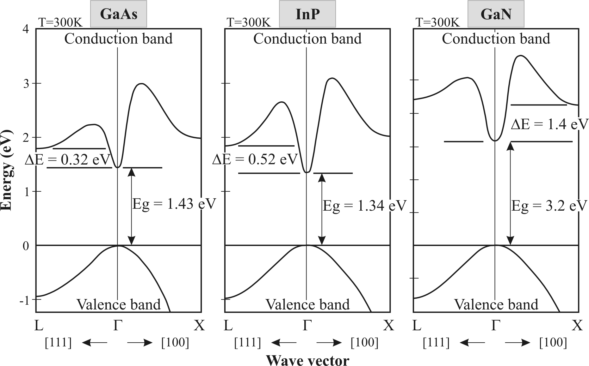

import { Image } from 'astro:assets';
import npnmosfet from '../../assets/transistors/npnmosfet.png?url';
import bjtnpn from '../../assets/transistors/bjtnpn.jpg?url';
import bandgap from '../../assets/transistors/bandgap.png?url';
import Latex from '../../components/Latex.astro';

## Discusión

 La revolución informática moderna 
se dió gracias primordialmente a la producción masiva de dispositivos a base de materiales semiconductivos.
Inicialmente, fueron los tubos al vacío los cuales abrieron las puertas al mundo computacional.
Mas no abastaron gracias a sus costos de manufactura, fragilidad, bajo volumen de producción, 
y desperdicio energético.

En la modernidad, utilizamos los componentes llamados **Transistores** para
todos los electrónicos del día a día. Los transistores son indispensables
gracias a sus características energéticas, tanto térmicas como electroconductivas.
Es vital que estos sean semiconductores[^1] ya que brindan la capacidad de actuar como
interruptores ("_switches_") sin la interacción física directa de una persona.

 
La clasificacion de semiconductor es una a base de la capacidad
que presenta un material para selectivamente permitir el flujo de corriente.
En las Ciencias de Materiales, se utiliza la brecha energética para categorizar a
los materiales en cuanto a su capacidad de permitir un flujo de electrones.

La brecha energética es una característica intrínsica de los compuestos y elementos que se basa en la relacion de las 
capas de electrones.
La brecha se podría definir como una función del potencial eléctrico necesario
para que un electrón pase de la capa de valencia hacia una capa de conducción.

{/*  */}
<Image
 width="400"
 height="400"
 alt="Brecha Energetica"
 src={bandgap}/>

[^1]: Nota: Los materiales son clasificados comunmente en las siguientes categorías de conductividad energética: Conductivos, Semiconductivos, Insulantes y Superconductivos.

 Pero, si se supone que actúen como interruptores y no los tocamos para que operen,
¿ cómo cambian de un estado a otro (de encendido a apagado y viceversa) ? 

 ¡Sencillo! Utilizamos Voltaje o Corriente ⚡️ en uno de sus terminales.

## Usos
- Amplificadores
- Memoria de Computadoras RAM/SSD (Ordenadores)
- CPUs / SoC´s

## Tipos de Transistores
- BJT's (Bipolar Junction Transistors)
- MOSFET (Metal-Oxide Silicon Field Effect Transistors)

## Características
- Mínimo tres terminales de conexión
- Creados a base de materiales semiconductores: Galio, Arsénico, Silicio, Germanio, Indio

### BJT
> Terminales
 - **B**ase
 - **C**olector
 - **E**misor

 {/*  */}
<Image
 width="200"
 height="200"
 alt="BJT"
 src={bjtnpn}/>

### FET
> Terminales
- **G**ate (Compuerta)
- **S**ource (Fuente)
- **D**rain (Drenaje)

<Image
 width="200"
 height="200"
 alt="NMOS"
 src={npnmosfet}/>

### Ecuaciones Caracteristicas
---
#### MOSFET (NMOS) Activo
<Latex formula='I_{ds} = \frac{W}{L} \mu_{n} C_{ox} (V_{gs} - V_{th}) V_{ds}'/>
<Latex formula=' R_{eq} = \frac{V_{ds}}{I_{ds}}'/>
---
#### BJT (npn) Activo
<Latex formula='\beta = i_c / i_b'/>
<Latex formula='i_b = (I_s / \beta )e^{v_{be} / v_t}'/>
<Latex formula='i_c = I_s e^{v_{be} / v_t}'/>
---
#### BJT (npn) Saturado
<Latex formula=' I_e = I_c + I_b'/> 
<Latex formula=' I_e = (\beta + 1) I_b'/> 
<Latex formula=' I_c = \beta I_b'/>
<Latex formula=' I_c = (\beta) / (\beta + 1) I_e'/> 
<Latex formula=' I_c(sat) = (V_{cc} - V_{ce}(sat)) / R_c'/>
<Latex formula=' \alpha = \beta / (\beta + 1)'/>

## Referencias
- [MIT Opencourse Ware](https://ocw.mit.edu/courses/6-071j-introduction-to-electronics-signals-and-measurement-spring-2006/b30aa58fb0c9915da21e5a5855384818_19_bjt_1.pdf)